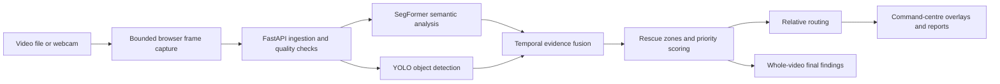

# FloodSight

### From drone observations to explainable flood-response decisions

FloodSight is a flood-response decision-intelligence website for emergency command teams. It analyzes uploaded drone video or a live webcam feed and converts visual observations into traceable evidence: detected people and vehicles, flood and damage indicators when the required model is available, rescue zones, explainable priority rankings, relative access routes, and a final whole-video incident summary.

> [!IMPORTANT]
> FloodSight is a decision-support tool for trained emergency personnel. It does not autonomously make life-critical decisions. All priorities and routes must be reviewed against current field information.

## What the website does

The command-centre interface lets an operator:

- Upload and analyze a local flood-response video.
- Use a webcam as a live observation source.
- View model detections as bounding boxes over the actual media.
- View semantic flood, road, building-damage, and rescue-zone overlays when supporting evidence is available.
- See people, vehicles, blocked-road evidence, flood coverage, damage coverage, incident severity, and model availability.
- Review explainable rescue priorities, including the evidence and score behind each ranked zone.
- Inspect relative image-space access routes and alternatives.
- Receive a final findings table after the complete video has been analyzed.
- Generate an incident report from backend-computed intelligence.
- Run an explicitly labelled deterministic demo when real model artifacts are not configured.

The final findings are aggregated across all analyzed video samples, not only the last frame. Earlier high-priority observations are retained with their source frame and video timestamp.

## Analysis flow



Frame acknowledgements and intelligence updates use separate WebSocket messages. The backend maintains bounded latest-frame work rather than allowing an unbounded queue, and raw video frames are not persisted by the ingestion pipeline.

## Core capabilities

### Visual intelligence

- YOLO-based person and vehicle detection with original-image bounding boxes.
- SegFormer-based semantic evidence for flood, roads, buildings, vegetation, terrain, pools, and building damage.
- Distinct flooded-road, blocked-road, clear-road, and unknown-road states.
- Detection profiles for standard, aerial, and aerial high-recall observation.

### Decision intelligence

- Deterministic evidence-grid fusion and rescue-zone generation.
- Temporal tracking with bounded history, decay, and stable zone identities.
- Explainable 0-100 priority scoring with individual reason contributions.
- Relative accessibility graphs, primary routes, and alternatives.
- Whole-video aggregation of peak observations, detected classes, strongest rescue priorities, and evidence availability.

### Honest evidence provenance

FloodSight keeps the origin of each value visible and structurally distinct:

| Provenance | Meaning |
| --- | --- |
| `REAL_ML_OUTPUT` | Direct output from an active segmentation or detection model |
| `DERIVED_ANALYTIC` | Zones, scores, routes, fusion, quality metrics, and reports derived from evidence |
| `GIS_EXTERNAL_DATA` | Evidence from a genuinely connected geographic data source |
| `DEMO_SIMULATED` | Explicit deterministic demonstration data |
| `HUMAN_VERIFIED` | Evidence confirmed through a human review workflow |

Missing models never silently produce simulated operational results. The UI displays `MODEL_UNAVAILABLE`, `DEGRADED`, or the applicable real/fallback state for each capability.

## Technology stack

- Frontend: React, TypeScript, Vite, Tailwind CSS
- Backend: Python, FastAPI, REST, WebSockets
- Machine learning: SegFormer, YOLO, PyTorch, Transformers, Ultralytics
- Intelligence: temporal scene fusion, rescue-zone generation, explainable scoring, relative routing
- Validation: Pytest, Ruff, Vitest, ESLint, TypeScript

## Start the website locally

### Prerequisites

- Git
- Python 3.11 or newer
- Node.js 20.19+ or 22.12+
- npm
- A modern browser

A CUDA-capable NVIDIA GPU is optional but recommended for local real-model inference.

### Windows PowerShell

```powershell
git clone https://github.com/quantum-banana/floodsight.git
cd floodsight

Set-ExecutionPolicy -Scope Process Bypass
Copy-Item .env.example .env
Copy-Item frontend\.env.example frontend\.env.local

.\scripts\setup.ps1
.\scripts\dev.ps1
```

### Linux or macOS

```bash
git clone https://github.com/quantum-banana/floodsight.git
cd floodsight

cp .env.example .env
cp frontend/.env.example frontend/.env.local
chmod +x scripts/*.sh

./scripts/setup.sh
./scripts/dev.sh
```

After startup, open:

| Service | Address |
| --- | --- |
| FloodSight command centre | [http://localhost:5173](http://localhost:5173) |
| System diagnostics | [http://localhost:5173/system](http://localhost:5173/system) |
| Backend API | [http://localhost:8000](http://localhost:8000) |
| Interactive API documentation | [http://localhost:8000/docs](http://localhost:8000/docs) |

Press `Ctrl+C` in the development terminal to stop both services.

### Start the services manually

If dependencies are already installed, use two terminals from the repository root.

Terminal 1 - backend:

```powershell
Set-Location backend
..\.venv\Scripts\python.exe -m uvicorn app.main:app --reload --host 127.0.0.1 --port 8000
```

Terminal 2 - frontend:

```powershell
Set-Location frontend
npm run dev -- --host 127.0.0.1
```

## Configure real model inference

The API and the labelled FS-001 demo run without local model artifacts. Real media analysis requires compatible model checkpoints outside the Git repository.

1. Install optional inference dependencies:

   ```powershell
   .\.venv\Scripts\python.exe -m pip install -e ".\backend[inference]"
   ```

2. Set the applicable paths in `.env`:

   ```dotenv
   FLOODSIGHT_SEGMENTATION_CHECKPOINT=D:/FloodSight-Models/segformer-checkpoint
   FLOODSIGHT_DETECTION_CHECKPOINT=D:/FloodSight-Models/floodsight-yolo.pt
   FLOODSIGHT_DETECTION_FALLBACK_CHECKPOINT=D:/FloodSight-Models/yolo-coco-fallback.pt
   ```

3. Restart the backend and check [http://localhost:5173/system](http://localhost:5173/system).

The model registry is stored at [`configs/models/registry.json`](configs/models/registry.json). Artifact paths and datasets must remain outside Git. A pretrained COCO fallback is visibly labelled as fallback evidence and is not presented as the final FloodSight/VisDrone detector.

## Analyze a video

1. Open the command centre.
2. Select **Video file** and choose a local video.
3. Choose the appropriate detection profile.
4. Start playback and allow the video to reach its natural end.
5. Wait while the interface changes from **Finalising** to **Complete**.
6. Review **Final video findings** in the right-hand panel.

The final panel shows analyzed-frame counts, available peak statistics, detected object classes, incident severity, and rescue priorities retained from anywhere in the video. Metrics whose supporting model was unavailable remain clearly marked **Unavailable** instead of displaying invented zeroes.

## Main API endpoints

| Method | Path | Purpose |
| --- | --- | --- |
| `GET` | `/health` | Backend health check |
| `GET` | `/api/models/status` | Sanitized model status, mode, device, and availability |
| `POST` | `/api/ingest/sessions` | Create a bounded video or webcam ingestion session |
| `GET` | `/api/ingest/sessions/{session_id}` | Read session state and counters |
| `POST` | `/api/ingest/sessions/{session_id}/complete` | Finalize a video and return whole-video findings |
| `GET` | `/api/ingest/sessions/{session_id}/intelligence` | Read the latest frame intelligence |
| `GET` | `/api/ingest/sessions/{session_id}/report` | Generate the current or final incident report |
| `DELETE` | `/api/ingest/sessions/{session_id}` | Stop and remove an ingestion session |
| `WS` | `/ws/ingest/sessions/{session_id}/frames` | Send frame metadata/binary data and receive acknowledgements/intelligence |

## Project structure

```text
floodsight/
|-- backend/          FastAPI application, inference adapters, and intelligence services
|-- frontend/         React command-centre interface
|-- configs/          Model registry and configuration
|-- shared/           JSON contracts and frozen taxonomies
|-- ml/               Isolated dataset preparation and validation tooling
|-- scripts/          Setup, development, verification, and dataset scripts
|-- docs/             Architecture, taxonomy, dataset, and operational documentation
|-- tests/            Repository-level contract tests
`-- demo/             Explicitly labelled deterministic demonstration assets
```

## Verification

Run the complete repository checks on Windows:

```powershell
.\scripts\check.ps1
git diff --check
```

Application-only checks:

```powershell
.\.venv\Scripts\python.exe -m ruff check backend
Push-Location backend
..\.venv\Scripts\python.exe -m pytest -q
Pop-Location

Push-Location frontend
npm run lint
npm test -- --run
npm run build
Pop-Location
```

## Additional documentation

- [`docs/FLOODSIGHT_MASTER_CONTEXT.md`](docs/FLOODSIGHT_MASTER_CONTEXT.md) - product scope, architecture, and implementation phases
- [`docs/TAXONOMY.md`](docs/TAXONOMY.md) - product, segmentation, and detection taxonomies
- [`docs/DATASETS.md`](docs/DATASETS.md) - dataset boundaries and preparation workflow
- [`docs/DATASET_SERVER_RUNBOOK.md`](docs/DATASET_SERVER_RUNBOOK.md) - external dataset server operations
- [`docs/PARALLEL_INTEGRATION.md`](docs/PARALLEL_INTEGRATION.md) - model/application integration notes

## Data and safety boundaries

- Keep datasets, archives, checkpoints, caches, and experiment runs outside this repository under explicit external paths.
- Treat raw source datasets as immutable.
- Do not infer or silently merge unknown dataset labels.
- Treat image-relative routes as tactical visual guidance, not GIS distance or travel-time claims.
- Require trained personnel to review priorities, routes, model availability, and current field conditions before acting.
